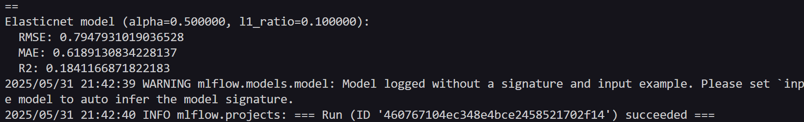

# Example MLflow Project

## Usage with VSCode and Python Virtual Environment (venv)

In this setup, I use VSCode as the IDE and a Python virtual environment (`venv`) to manage dependencies.
  
To run this MLflow project, use the following command:

```bash
mlflow run https://github.com/eriksszva/mlflow-example.git -P alpha=0.5 --env-manager=local
```

---

### Important Notes

* The `--env-manager=local` option tells MLflow to **use current active Python environment (venv)** instead of creating a new environment.
* When using `--env-manager=local`, MLflow **ignores** the `conda_env:` or `python_env:` fields in the `MLproject` file.
* This means MLflow will **not** create or manage any new environments; it simply runs code within the activated virtual environment.
* Because of this, **need to manually prepare the environment** by installing all required dependencies beforehand.

---

### Why this approach?

* MLflow supports multiple environment managers, such as Conda and the newer Python Environment specification (PEP 665).
* However, when using a **venv**, MLflow cannot (and should not) automatically create or manage environments for you.
* Using `--env-manager=local` lets you retain full control over your environment, which is especially useful when you want to use an existing `venv` in VSCode.
* This avoids conflicts or unexpected environment creation that could break your workflow.
* Since MLflow skips environment setup in this mode, you must **manually install all dependencies listed in `python_env.yaml` or `conda.yaml`** using `pip` in your activated `venv`.

---

### Setup Steps

1. **Create and activate virtual environment** (if you haven’t yet):

   ```bash
   python -m venv venv

   # Windows
   .\venv\Scripts\activate

   # macOS/Linux
   source venv/bin/activate
   ```

2. **Manually install the required dependencies listed in `python_env.yaml`**:

   ```bash
   pip install numpy>=1.14.3 pandas>=1.0.0 scikit-learn>0.19.1 mlflow
   ```

   *(Add any other packages listed in your `python_env.yaml` here.)*

3. **Push your changes to the remote repository** (if applicable) before running MLflow.

4. **Run the MLflow project using your active environment**:

   ```bash
   mlflow run https://github.com/eriksszva/mlflow-example.git -P alpha=0.5 --env-manager=local
   ```

---

### Result on Terminal:
    


